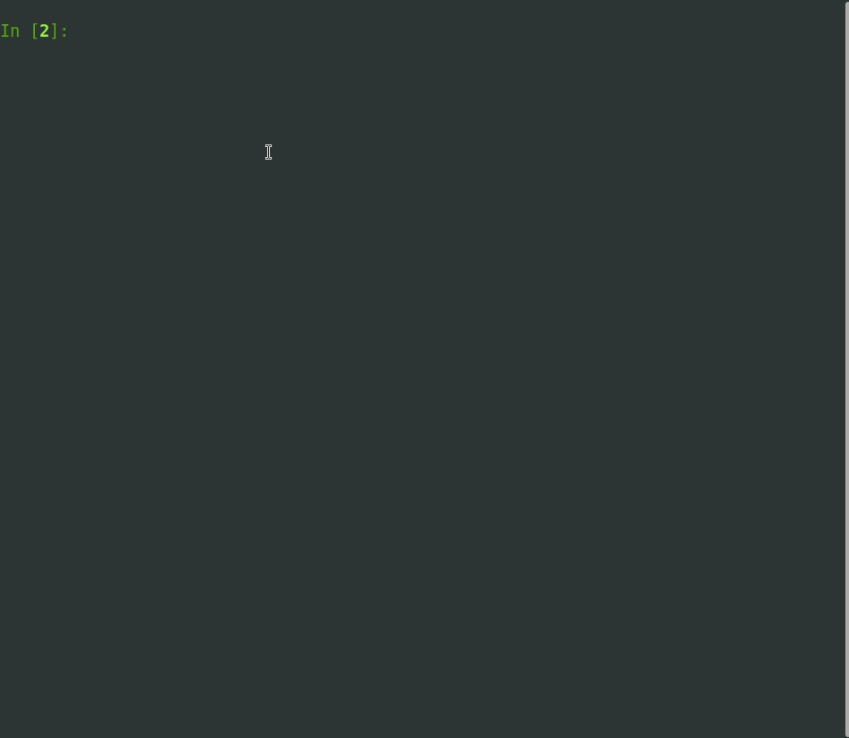

<h1 align="center">
  <br>
  
  <br>


</h1>

# 🔭 Overview
vcfio is an **efficient** and **easy-to-use** package for [VCF](https://samtools.github.io/hts-specs/VCFv4.2.pdf) reading, writing and manipluation.<br>
It is designed for robust variant processing, and requires *minimum* computing resources.

- ⚡ Fast - iterate >4500 variants per second
- 🪶 Lightweight - automatically parses only **crucial information** about variants (CHROM, POS, ID, REF, ALT, QUAL, FILTER), all the other information (INFO and SAMPLES) is parsed on demand
- 🏁 Efficient - No advanced parsing of lines and casting to hugh memory objects
- 🔌 Dependency free - We do have optional dependencies which enhance the package

# 🎯 Why ? 
The existing python VCF solutions were **extremely inefficient** - parsing every variant line in advance and casting 
every bit of data into their own objects or a list of strings, which is very memory-consuming.

This affected our runtime by a huge factor.

**We wrote vcfio to overcome those issues, making it a lightweight and dependency-free package.**


# ⚙️ ️Installation
```bash
# Basic installation
pip install vcfio

# Include optional dependencies
pip install vcfio[bio]
```

# ⭐ Features
:heavy_check_mark: **Read and write** plain and compressed vcf (no specification needed) - `file.vcf`, `file.vcf.gz`, `file.vcf.bgz`.<br>
:heavy_check_mark: **Automatically infer** the type of values in the file. For example `'1,2,3'` will yield `[1, 2, 3]`.<br>
:heavy_check_mark: **Parse** values __*on demand*__ for maximum efficiency.<br>
:heavy_check_mark: **Fetch** variant ranges within a chromosome.

# ❓ How to Use
### VcfReader
Here are some examples of what you can do with VcfReader
(We recommend you explore all the available methods)
<details>
    <summary>Click to view usage!</summary>
    
    
</details>

```python
import vcfio

with vcfio.VcfReader('/path/to/file.vcf') as reader:
    # Iterate variants
    for variant in reader:  # type: vcfio.Variant
        print(variant.to_vcf_line())
        
        # Iterate the variant's samples
        for sample_name, sample in variant.samples.items():  # type: AnyStr, EasyDict
            # Try to find "AD" in sample, if not found - find in variant's info, if the value is a dot - return None
            ad = variant.get_value('AD', sample_name, empty_value='.')        
            zygosity = variant.get_zygosity(sample_name)

    # Fetch variants within the range chr3:1-1000
    for variant in reader.fetch('chr3', start=1, end=1000):  # type: vcfio.Variant
        print(variant)
```
### VcfWriter
Here is an example of what you can do with VcfWriter
<details>
    <summary>Click to view usage!</summary>
    
</details>

```python
import vcfio

# This will open an existing vcf, introduce a new value to each variant's INFO and write to another vcf.gz
with vcfio.VcfReader('/path/to/output_file.vcf.gz') as reader, \
        vcfio.VcfWriter('/path/to/output.vcf', headers=reader.headers) as writer:  
    for variant in reader:  # type: vcfio.Variant
        variant.info['new_info_field'] = 'new_info_value'
        writer.write_variant(variant)
```

### Variant
Here are some examples of what you can do with Variant
(We recommend you to explore all the available methods)
<details>
    <summary>Click to view usage!</summary>
    
</details>

```python
import vcfio

variant_line = "chr1	726	.	G	C,T	500	.	DP=200;MQ=250.00	GT:AD:AF:DP:GQ	0/1:10,160,30:0.8,0.15:200:420"

# This will parse the raw variant line into a Variant instance
variant = vcfio.Variant.from_variant_line(variant_line, sample_names=['proband'])
print(
    variant.quality,                        # --> 726
    variant.chromosome,                     # --> "chr1"
    variant.alt,                            # --> ["C", "T"]
    variant.get_zygosity('proband'),        # --> "HET"
    variant.get_value('MQM', 'proband'),    # --> 250
    variant.samples['proband'].get('GT')    # --> "0/1"
)
```

### EasyDict
A Dict-inherited class with a smart `get` method. It's main (and only) feature is to automatically infer the type of the value it returns.
A vcf file rarely specifies the type of values within the variant's data so this object makes a bioinformaticaion's life easier and exempts him from casting-duty.
It is used in `vcfio.Variant`'s attributes.
```python
d = EasyDict({
	'simple_int': 1,
	'not_simple_int': '2',
	'this_is_not_a_list': ['abc'],
	'list_of_numbers': ['1', 2, '3.1'],
	'this_is_a_real_list': ['a', 'b', 'c'],
	'dot_is_not_a_value': '.',
    'this_is_a_list': '1,2,3',
    'this_is_a_list_but_i_like_strings': '1,2,3'
}) 
d.get('simple_int')                                                 # --> 1
d.get('not_simple_int', infer_type=True)                            # --> 2
d.get('this_is_not_a_list', infer_type=True)                        # --> 'abc'
d.get('list_of_numbers', infer_type=True)                           # --> [1, 2, 3.1]
d.get('this_is_a_real_list', infer_type=True)                       # --> ['a', 'b', 'c']
d.get('dot_is_not_a_value', empty_value='.', infer_type=True)       # --> None
d.get('this_is_a_list', empty_value='.', infer_type=True)           # --> [1, 2, 3]
d.get('this_is_a_list_but_i_like_strings', empty_value='.')         # --> '1,2,3' 
```

# Credits
This package uses the following open source packages:
- [PyVCF](https://github.com/jdoughertyii/PyVCF/)

# Contributors


<a href="https://github.com/emedgene/vcfio/graphs/contributors"></a>
